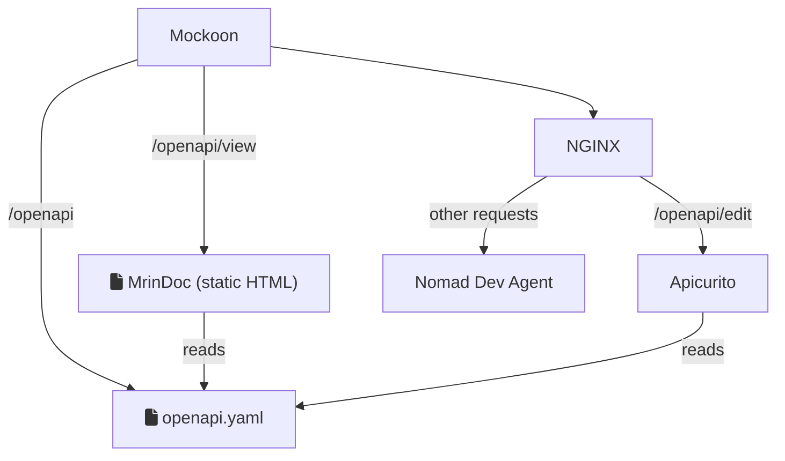

# SpecFirst Design Playground

## Build

## Run

- **Mockoon** - Simple mock API generator with passthrough proxy capabilities
- **MrinDoc** - OpenAPI viewer served as a single page application
- **NGINX** - Used as a reverse proxy since Mockoon can only perform a single
  passthrough
- **Apicurito** - OpenAPI editor running in Docker
- **Nomad Dev Agent** - Used to catch-all other requests

